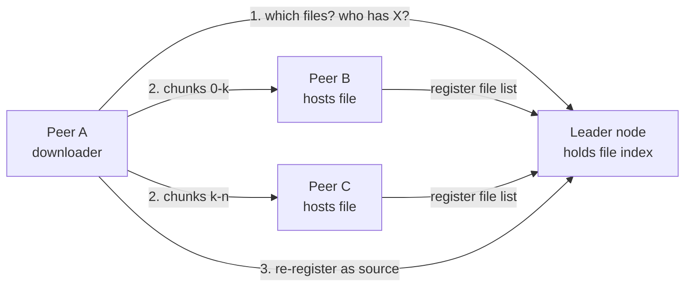
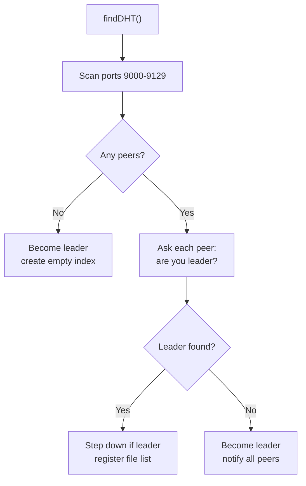
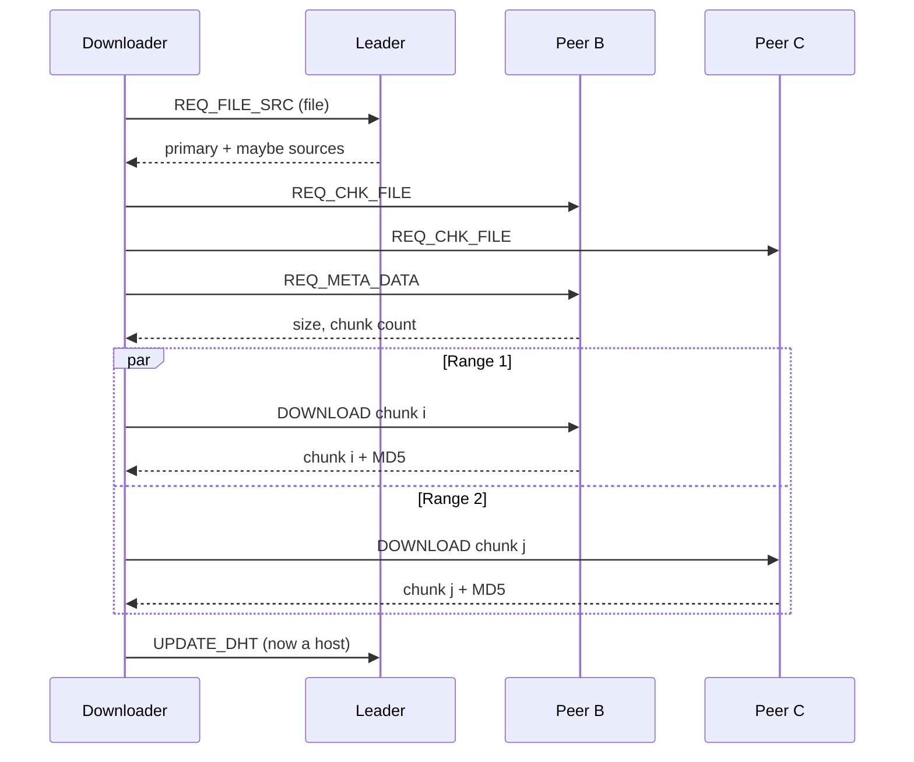

# P2P File Storage Cluster with Leader Election: Design Doc

Sep 24, 2026 · @Amit

## Overview

This system is a peer-to-peer file sharing cluster in Python where every node both hosts and downloads files, coordinated by one elected leader node. The leader keeps an index of which nodes hold which files. Peers ask the leader where a file lives, then download it directly from other peers in parallel, chunk by chunk, with an MD5 check on every chunk.

The project began as a programming assignment for CS550 Advanced Operating Systems at Illinois Institute of Technology in Fall 2020. It uses only the Python 3.8 standard library: `socket`, `threading`, `concurrent.futures`, `pickle` and `hashlib`.

## Goals and non-goals

The design aims for self-organizing coordination and fast, verified downloads, and deliberately leaves out production concerns like security and wide-area discovery.

**Goals**

- Any node can join without configuration and find the current leader on its own.
- The cluster always converges on one leader; if none exists, a node elects itself and announces it.
- The leader answers two questions: which files exist, and which nodes can serve a given file.
- Downloads pull different chunk ranges from several peers at once to use their combined bandwidth.
- Every chunk is verified with an MD5 hash and retried on mismatch.
- A node that finishes downloading becomes a new source for that file, so popular files spread through the cluster.

**Non-goals**

- Discovery across machines or networks. Nodes scan a fixed port range on one host.
- Security. There is no authentication or encryption, and messages use `pickle`.
- Guaranteed replication or durability. Files spread only when peers choose to download them.
- A true distributed hash table. The index lives on one node, the leader.

## Architecture

Every node runs the same program, and the only difference between them is whether a node currently holds the leader role. The leader handles index lookups; file data always flows directly between peers.

A download takes three steps: ask the leader for sources, pull chunk ranges from several peers in parallel, then re-register with the leader as a new source.

| Component | Role |
| --- | --- |
| Listener (`setupServer`) | Accepts inbound TCP connections and gives each one its own handler thread. |
| Connection handler (`ConnThread`) | One thread per connection. Sends requests, receives messages and dispatches on message type. |
| File index (`DHT` class) | Exists only on the leader. Maps file names to the nodes that host them. |
| Leader election (`findDHT`) | Finds the current leader, or claims leadership and announces it. |
| Download engine (`downloadHandler`, `downloadFrom`) | Splits a file into chunk ranges and fetches them from several peers in parallel. |
| Local store | A per-node directory, `<dir>/<port>/`, holding the files the node serves. |

## Wire protocol

Nodes talk over TCP using a length-prefixed framing: a 16-byte ASCII header holding the payload length, followed by a pickled Python dictionary. The receiver reads the header first, then keeps reading until it has exactly that many bytes, so a message can span many TCP reads.

| Setting | Value | Purpose |
| --- | --- | --- |
| `HEADER` | 16 bytes | Fixed-width length prefix |
| `PACKET` | 2,048 bytes | Send and receive buffer size |
| `CHUNK_SIZE` | 1,536 bytes | File data per chunk, sized so a chunk message fits in about one packet |
| Default port | 9000 | First port in the discovery range |

Every message is a dictionary whose `main` key names its type. Requests and responses come in pairs.

| Request | Response | Handled by | Meaning |
| --- | --- | --- | --- |
| `LEADER_CHECK` | `RES_LEADER_CHECK` | Any node | Are you the leader? Also adds the sender to the node list. |
| `UPDATE_LEADER` | None | Any node | A new leader was elected; re-register with it. |
| `UPDATE_DHT` | `RES_UPDATE_DHT` | Leader | Register or refresh this node's file list. |
| `DEACTIVE_NODE` | None | Leader | Remove this node from the index. |
| `FILE_LIST` | `RES_FILE_LIST` | Leader | List all files in the cluster. |
| `REQ_FILE_SRC_MESSAGE` | `RES_FILE_SRC_MESSAGE` | Leader | Which nodes can serve this file? |
| `REQ_CHK_FILE` | `RES_CHK_FILE` | Peer | Do you really have this file? |
| `REQ_META_DATA` | `RES_META_DATA` | Peer | File size and chunk count. |
| `DOWNLOAD` | `RES_DOWNLOAD` | Peer | Send chunk *n* with its MD5 hash. |
| `DISCONNECT` | None | Any node | Close this connection. |

A non-leader that receives a leader-only request replies with `status: False`. The caller treats that as a sign that its view of the leader is stale.

## Node discovery and leader election

The election rule is "an existing leader wins": a node joins whatever leader it finds, and only claims leadership when no node answers as leader. This differs from the Bully or Ring algorithms, which pick a winner by node ID; here the first node to take the role keeps it while it stays reachable.

**Discovery.** `updateNodeList` tries to open a TCP connection to every port from 9000 to 9129 on the node's own IP, skipping its own port. Each port that accepts is added to `NODE_LIST`. Nodes also learn about each other passively, because any node receiving a `LEADER_CHECK` adds the sender to its list.

The flow runs each time a node starts and whenever it detects the leader may be gone.

1. **No peers found.** The node becomes leader and creates an empty index.
2. **A peer answers as leader.** The node records `DHT_ADDR`, registers its local file list with `UPDATE_DHT`, and steps down if it was leader itself.
3. **Peers exist but none is leader.** The node becomes leader and sends `UPDATE_LEADER` to every peer. Each peer then re-registers its files, so the new leader rebuilds the full index from scratch.

Step 3 is the key recovery property. The index is soft state: no node needs to replicate it, because every peer can rebuild it by re-sending its own file list.

**Leader step-down.** A leader re-runs `findDHT` when its tracked connection count drops to zero, at most once every 5 seconds. If it finds another leader, it logs how long it held the role and joins the other leader. This resolves split-brain after two nodes claim leadership at the same time, though only once the leaders happen to probe each other.

## File index and source lookup

The leader keeps two maps from file name to node addresses: confirmed hosts, and "maybe" hosts that have asked for the file and are probably downloading it. The code calls this class `DHT`, but it is a centralized index held by the leader rather than a distributed hash table.

| Map | Holds | Updated when |
| --- | --- | --- |
| `data` (primary) | Nodes that registered the file in their local store | A node sends `UPDATE_DHT` with its file list |
| `data_second` (secondary) | Nodes that requested sources for the file | A node sends `REQ_FILE_SRC_MESSAGE` for a file it doesn't host |

- **Register (`update`).** Adds the node to `data` for each file it hosts, and removes it from `data_second` for those files, promoting it from "maybe" to confirmed.
- **Lookup (`sourceList`).** Returns the primary and secondary lists, and adds the requester to the secondary list.
- **Remove (`delete`).** Drops the node from every primary entry, and deletes files left with no hosts.
- **List (`fileList`).** Returns every file name with at least one host.

The secondary list is a bet on popularity: a node that just asked for a file will likely have it soon. The downloader can choose confirmed hosts, maybe hosts or both. Before using any source it sends `REQ_CHK_FILE` to confirm the file is really there, so a stale maybe entry costs one round trip rather than a failed download.

## Chunked parallel download

A file of *n* chunks is split into one contiguous range per verified source, and all ranges download at the same time on separate threads. With *k* sources, the first gets floor(n/k) + (n mod k) chunks and each other source gets floor(n/k). For example, 10 chunks over 3 sources splits as 4, 3 and 3. The code calls this "windowed round-robin"; each source's window is one contiguous range.

The downloader confirms each source, fetches metadata once, pulls the ranges in parallel, then registers as a new host.

**Integrity.** The serving peer computes an MD5 hash of each chunk and sends it with the data. The downloader recomputes the hash and also checks that the file name and chunk number match its request. On any mismatch it discards the chunk and requests it again.

**Reassembly.** Each range thread returns its index and its bytes. The handler places them in an array by index, so ranges can finish in any order. It then concatenates the array and writes the file to the local store.

**Spreading files.** After saving, the node sends `UPDATE_DHT` with its new file list. It becomes a confirmed host, so the next downloader of that file has one more source to split the work across.

## Concurrency model

Each node uses a thread per connection plus a thread pool for downloads, and passes responses from receiver threads to callers through per-connection buffer fields.

| Thread | Created by | Job |
| --- | --- | --- |
| Listener | `main` at startup | Blocks on `accept()` and starts a `ConnThread` for each inbound connection. |
| Inbound `ConnThread` | Listener | Reads and answers requests from one remote node. |
| Outbound `ConnThread` | Any caller needing a peer | Its `run()` loop receives responses, while the caller's thread sends requests. |
| Download workers | `ThreadPoolExecutor` in `downloadHandler` | One per source, each fetching its chunk range over its own connection. |
| Main thread | Program start | Runs election, then the user menu or test loop. |

**Request and response handoff.** An outbound `ConnThread` splits sending and receiving across two threads. The caller sends a request, then polls a buffer field such as `buffer_file_list` every 0.1 seconds, or every 0.5 ms for chunk downloads. The receiver thread fills that field when the matching response arrives, and the caller reads it and resets it to `None`. This works because each connection has at most one request outstanding at a time.

**Shared state.** Leader status, the leader address, the node list, the index and the byte counters are module-level globals shared by all threads. They are updated without locks, which relies on Python's global interpreter lock making single operations atomic. The Limitations section covers where this falls short.

## Failure handling

The system recovers from leader loss by re-electing and rebuilding the index from peers, but it detects failures lazily, when a connection fails, rather than with heartbeats.

| Failure | How it's detected | What happens |
| --- | --- | --- |
| Leader crashes | A node's next connection to the old leader fails | The node runs `findDHT`. If no leader answers, it takes over and notifies all peers, which re-register and rebuild the index. |
| Two nodes both claim leader | A leader re-checks when its connection count reaches zero | The leader that finds the other steps down and registers with it. |
| Request sent to a non-leader | The reply carries `status: False` | Registration retries, and `findDHT` repeats until a leader accepts it. |
| Corrupted or mismatched chunk | MD5, file name or chunk number differs | The chunk is discarded and requested again. |
| Stale "maybe" source | `REQ_CHK_FILE` returns `False` | The source is skipped before the download starts. |
| Source peer crashes mid-download | The receiver sees the connection close | Not recovered. The download thread keeps waiting for its chunk (see Limitations). |
| Node leaves the cluster | Only when it sends `DEACTIVE_NODE` | The leader removes it from the index. The message exists, but the shutdown path doesn't send it yet. |

Rebuilding the index from peers keeps failover simple. The trade-off is a short window after failover where the new leader's index is incomplete while peers re-register.

## Testing and measurement

A test mode, started with the `-t` flag, runs the full download flow without user input so many nodes can be benchmarked together.

1. Start several nodes on consecutive ports, each with `-t` and its own hosted files.
2. Nodes elect a leader and register, then wait for a `TEST_MESSAGE`.
3. On that message, each node fetches the first file in the index from its confirmed hosts and re-registers.
4. Each node logs total bytes sent and received, then clears its log after 30 seconds for the next run.

**What is logged.** Each node writes to `./logs/Node-<port>.log`: connections, election events, index updates, and per-chunk upload and download sizes and times. Leaders also log how long they held the role before stepping down.

**Running it.** Each node is one process: `python node.py --port 9001 --dir ./hosted_files`. The default port is 9000 and the default directory is `./hosted_files`. Files placed in `<dir>/<port>/` are served by that node.

## Known limitations and future work

The biggest gaps are failure detection, fault tolerance during downloads, and network safety; each has a well-known fix.

| Area | Current behavior | Improvement |
| --- | --- | --- |
| Election | No tie-break, so two simultaneous starters can both lead until they probe each other | Deterministic winner by node ID (Bully), or a quorum protocol such as Raft |
| Failure detection | A dead leader is noticed only on the next failed connection | Periodic heartbeats with timeouts |
| Index availability | The index lives only on the leader, which also carries every lookup | Replicate the index to followers, or partition it with consistent hashing (a real DHT such as Chord or Kademlia) |
| Download fault tolerance | A source crashing mid-range leaves that thread waiting forever | Per-chunk timeouts, then reassign the unfinished range to another source |
| Load balancing | Ranges are fixed up front, so one slow source delays the whole file | Dynamic chunk scheduling where fast sources take more chunks |
| Serialization | `pickle` on network input lets a malicious peer run code on the receiver | JSON or MessagePack payloads, plus TLS and peer authentication |
| Thread safety | Shared globals change without locks, and callers busy-poll buffers | Locks around shared state, and `threading.Event` or queues for response handoff |
| Framing | The receiver reads in 2,048-byte blocks and assumes one message in flight per connection | Read exactly the remaining length, so pipelined messages can't bleed together |
| Memory use | Each chunk request reads the whole file; downloads assemble the whole file in memory | Seek to the chunk offset when serving; write each chunk to its offset when receiving |
| Discovery | Nodes find each other only on ports 9000 to 9129 of one host | Seed-node list or multicast discovery across machines |
| Index hygiene | Departed nodes stay in the "maybe" list; a lookup for an unknown file raises `KeyError` | Prune both maps on removal; return an empty result for unknown files |
| Graceful exit | `DEACTIVE_NODE` exists but isn't sent on shutdown | Send it from a shutdown handler |
| Integrity | MD5 catches corruption but not deliberate tampering | SHA-256 per chunk, plus a whole-file hash in the metadata |
